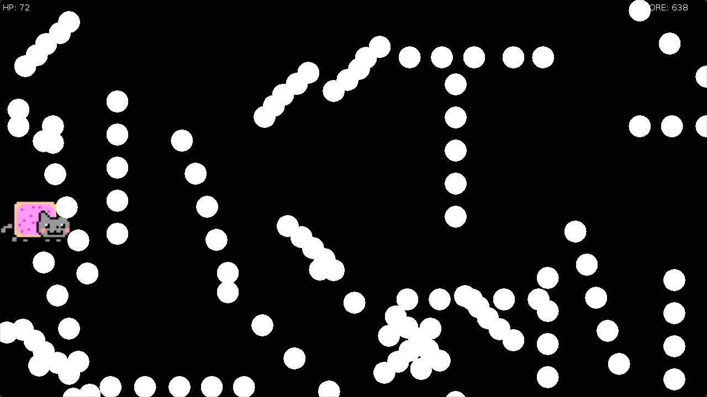

# nyan-kat

A practice project used to learn lua and Love2D



# Running

**Requirements**

Love2D installed and available via your `$PATH`

```bash
# from the current directory run
"<cmd-to-run-love2D>" ../nyan-kat
```
